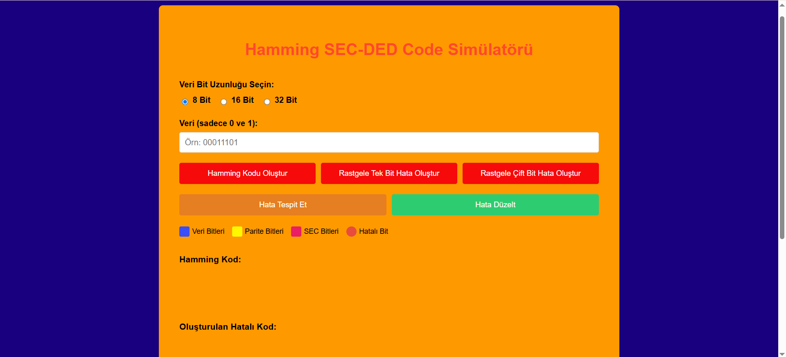
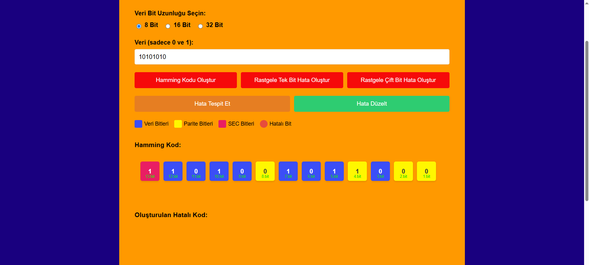
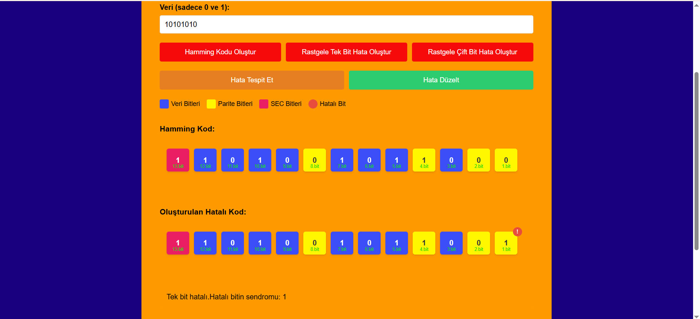
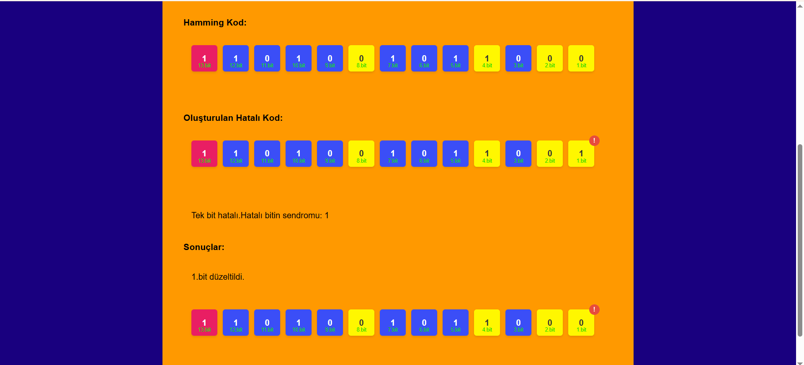
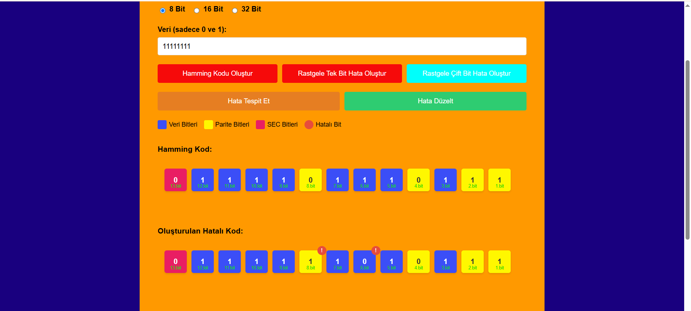
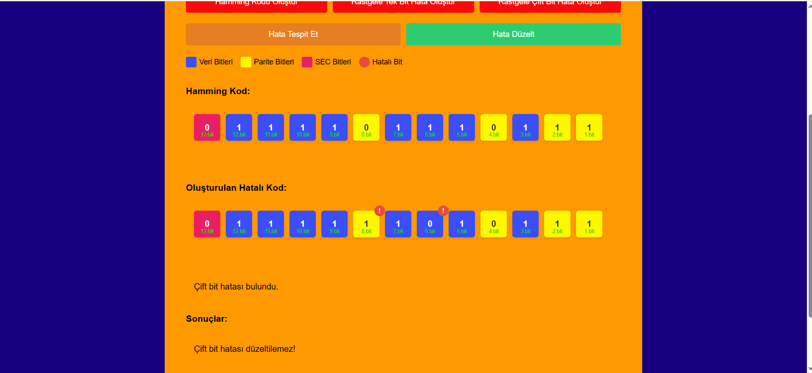

# Hamming SEC-DED Kod Simülatörü

Bu proje, Hamming SEC-DED (Single Error Correction - Double Error Detection) kodunun temel prensiplerini görsel olarak simüle eden ve kullanıcıya hata oluşturma, tespit etme ve düzeltme süreçlerini interaktif olarak gösteren bir uygulamadır. Hamming kodları, veri iletiminde oluşabilecek hataları tespit edip, tek bitlik hataları düzeltebilme kapasitesine sahip hata düzeltme kodlarıdır.

---
## 🌐 Canlı Demo

Projeyi çevrim içi olarak deneyimlemek için aşağıdaki bağlantıya tıklayabilirsiniz:

🔗 [https://esmabilen37.github.io/hamming-code-simulator/](https://esmabilen37.github.io/hamming-code-simulator/)

## Proje Hakkında

Hamming SEC-DED kodları, iletişim ve depolama sistemlerinde veri bütünlüğünü sağlamak için kullanılan önemli bir hata düzeltme yöntemidir. Bu proje ile:

- **Tek bitlik hatalar** rastgele oluşturulur, tespit edilir ve düzeltilir.  
- **Çift bitlik hatalar** rastgele oluşturulur ve tespit edilir (düzeltilemez).  
- Hata senaryoları için mimari şemalar kullanılarak sistem işleyişi görselleştirilir.  
- Kullanıcı, uygulama üzerinden hata oluşturma ve tespit süreçlerini takip edebilir.

---

## Proje Görselleri

### 1. İlk Hali - Temel Hamming Mimari Yapısı

---

### 2. Rastgele Tek Bit Hata Oluşturma, Tespit ve Düzeltme

- **Hata Oluşturma:** Rastgele tek bitlik hata üretimi için mimari yapıyı gösterir.  
    

- **Hata Tespiti:** Oluşan tek bitlik hatanın algılanması ve yerinin belirlenmesi süreci.  
    

- **Hata Düzeltme:** Tespit edilen tek bitlik hatanın düzeltilmesi mekanizmasını anlatır.  
  

---

### 3. Rastgele Çift Bit Hata Oluşturma ve Tespiti

Çift bitlik hata senaryoları için hazırlanan mimari:

- **Çift Bit Hata Oluşturma:** İki bitlik hatanın rastgele oluşturulması için kullanılan mimari yapı.  
  

- **Çift Bit Hata Tespiti:** Çift bit hataların tespiti ve bu durumda Hamming kodunun nasıl hareket ettiği açıklanır.  
  

Çift bit hatalar düzeltilemez, ancak tespit edilerek veri bütünlüğünün korunması için işlem yapılabilir.

---
## 🛠️ Kullanılan Teknolojiler

- HTML5
- JavaScript (Vanilla)
- CSS
---
🎬 **Demo Videosu:** [YouTube Üzerinde İzle](https://youtu.be/KR6ZeaimbMs)

